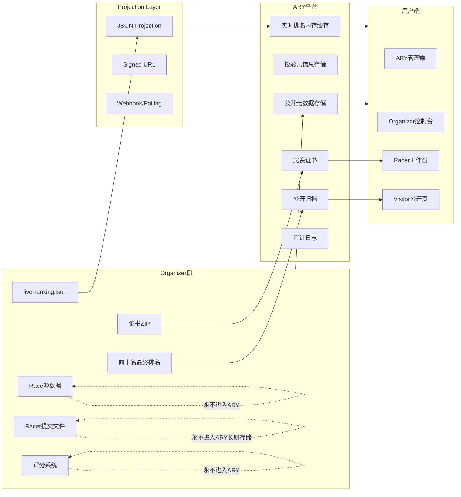
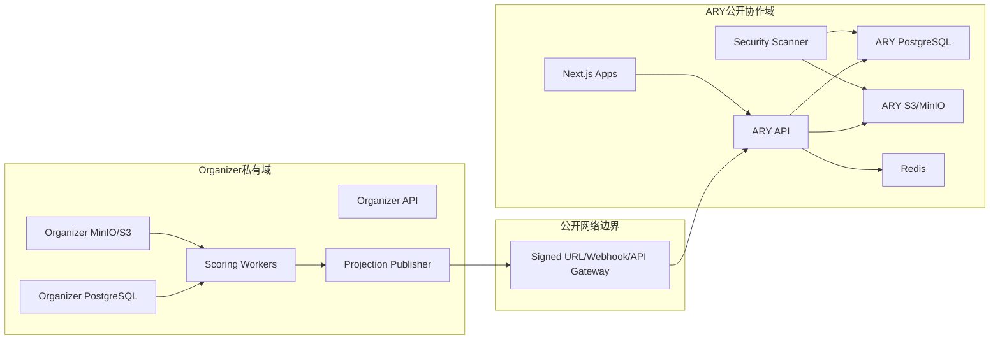
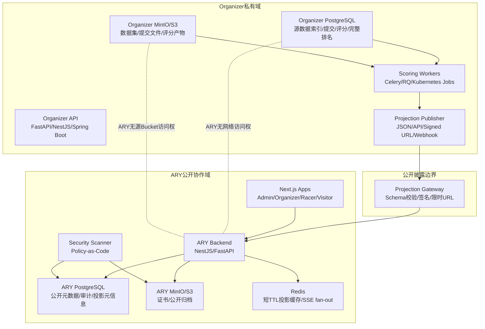
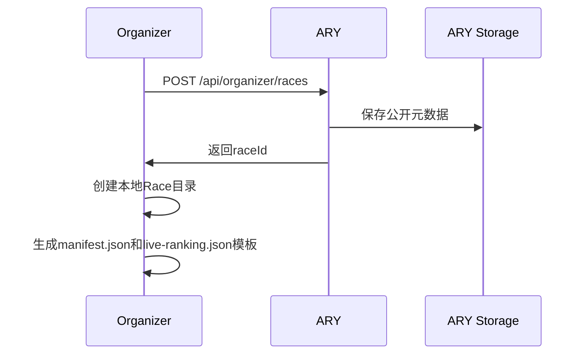
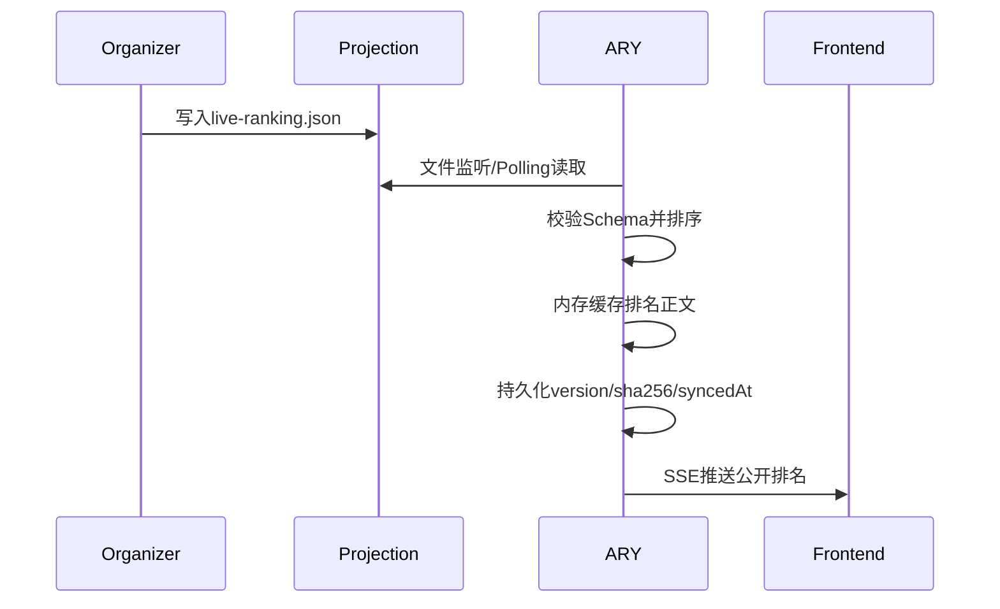
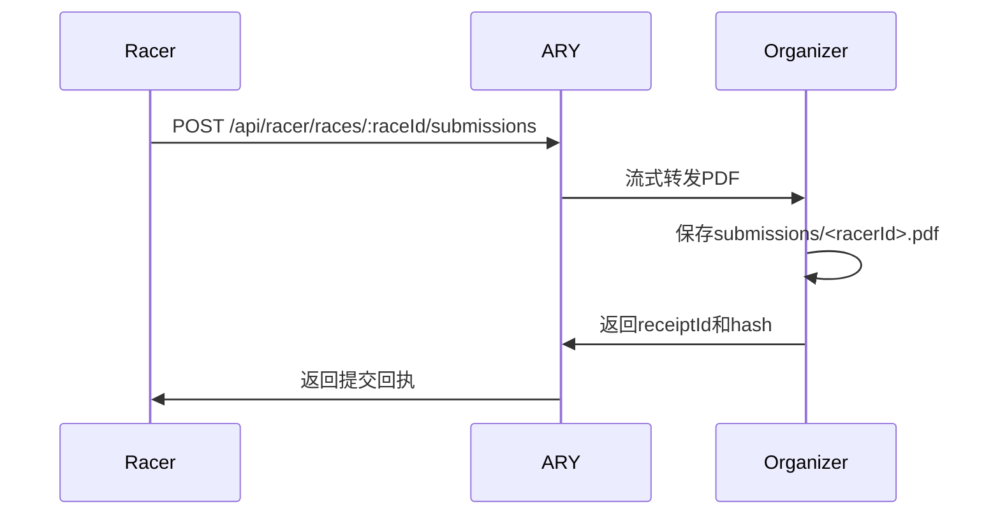
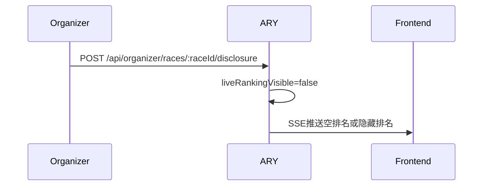
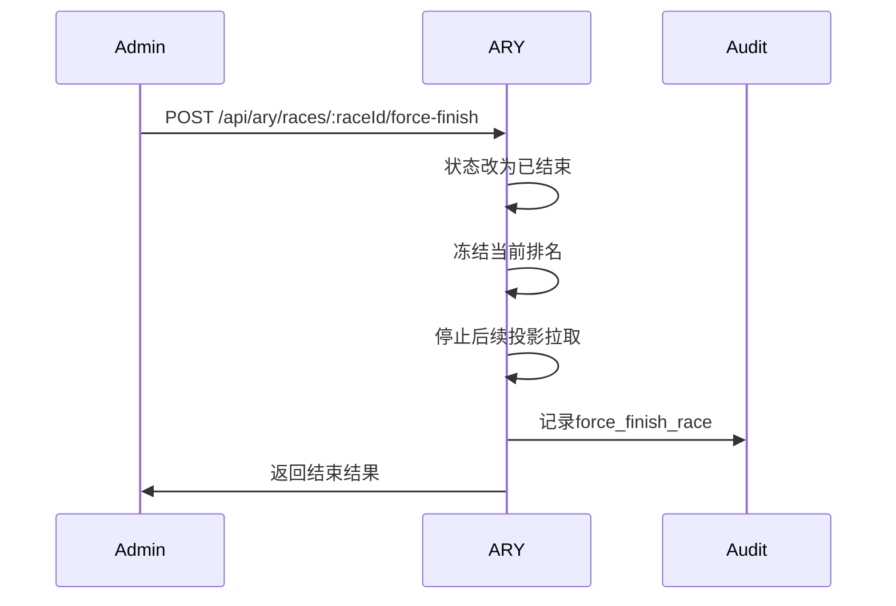
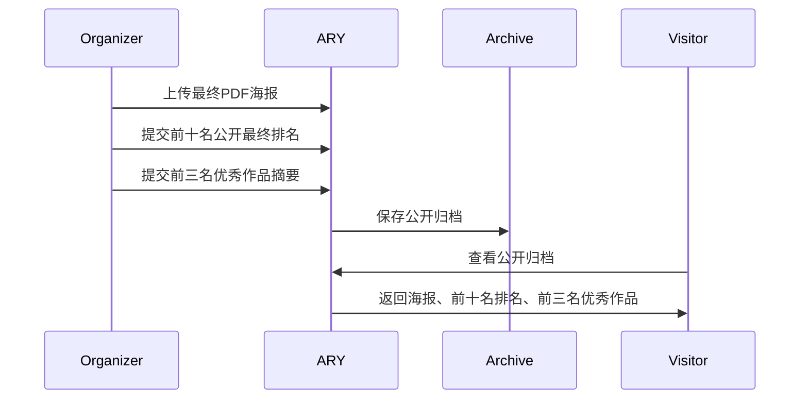
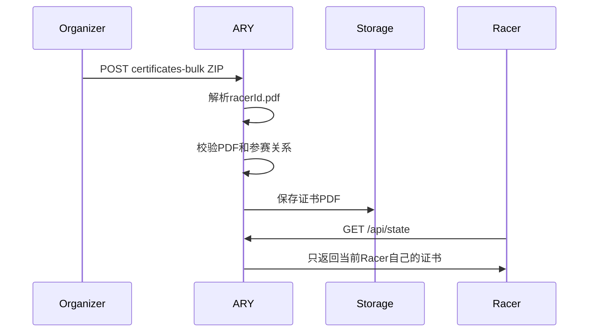

# ARY GRS-001 POC技术设计文档

## 1.背景与目标

ARY平台需要验证GRS-001(Global Race Sovereignty)数据主权原则的技术可行性。本POC的目标不是构建完整赛事平台，而是证明ARY可以在不持久化Race源数据的前提下，完成赛事创建、公开披露、实时排名展示、Racer参赛、完赛证书保存、归档发布和强制结束比赛等核心流程。

本POC必须明确体现：

- Race数据主权属于Organizer。
- Race源数据存留在Organizer侧。
- ARY不作为Race数据的中心化持久化存储平台。
- ARY只消费Organizer主动披露的公开元数据或公开投影数据。
- 如果方案默认把完整Race数据都存进ARY中央数据库，则不符合GRS-001核心命题。

## 2.GRS-001核心原则

### 2.1数据主权原则

Race的完整数据主权属于Organizer。Organizer有权决定：

- 是否创建Race。
- 是否公开Race元数据。
- 是否开启实时排名投影。
- 是否修改实时排名投影。
- 是否关闭或删除投影。
- 是否向ARY提交公开最终排名。
- 是否向ARY提交完赛证书。

ARY不能绕过Organizer直接获取源数据、评分细节、完整排名或敏感数据集。

### 2.2存储边界原则

ARY可以保存：

- Race创建信息。
- Race任务描述。
- Dataset Schema。
- API Contract。
- Organizer主动提交的前十名公开最终排名。
- 完赛证书。
- 公开归档材料。
- 投影数据的同步元信息，例如版本、哈希、同步时间、状态。
- 审计日志。

ARY不能保存：

- 原始训练数据。
- 原始测试数据。
- 医疗影像、教育数据、政府数据等敏感数据集。
- Racer原始提交文件。
- Organizer完整评分细节。
- Organizer完整排名系统。
- Organizer未主动披露的数据。

### 2.3公开投影原则

Organizer可以通过投影文件或投影API主动公开部分数据。例如：

```json
{
  "raceId": "race-001",
  "version": 3,
  "updatedAt": "2026-06-06T08:00:00.000Z",
  "scores": [
    { "racerId": "racer-001", "score": 98.5 },
    { "racerId": "racer-002", "score": 98 }
  ]
}
```

ARY只消费该公开投影，并在内存中排序和展示。ARY不把实时排名正文作为长期数据保存。

## 3.POC策略

### 3.1Race创建信息属于公开元数据

Race创建信息由Organizer按照ARY网站要求填写，例如：

```json
{
  "name": "Medical AI Challenge",
  "description": "医学影像分类赛事",
  "start_time": "2026-06-06T08:00:00.000Z",
  "end_time": "2026-06-06T10:00:00.000Z",
  "organizer": "organizer-001",
  "task_type": "classification"
}
```

这类信息天然属于公开赛事介绍，ARY可以长期保存。

### 3.2Race披露数据由Organizer侧投影实现

实时披露数据由Organizer侧生成，例如`live-ranking.json`。Organizer可以实时修改、关闭或删除投影。ARY只能展示当前可用投影。

### 3.3Race源数据永远留在Organizer侧

Race源数据包括但不限于：

- 原始提交记录。
- 医疗影像。
- 教育数据。
- 用户上传文件。
- 训练数据。
- 测试数据。
- 评分日志。
- 评分细节。

这些数据永远保留在Organizer侧，ARY不保存、不同步、不备份、不长期缓存。

### 3.4Race结束后的完整排名属于Organizer私有数据

Race结束后的完整排名仍属于Organizer私有数据。ARY只保存Organizer主动提交给ARY公开展示的前十名最终排名，字段限定为：

```json
[
  { "rank": 1, "racerId": "racer-001", "score": 98.5 },
  { "rank": 2, "racerId": "racer-002", "score": 98 }
]
```

ARY不保存完整排名、不保存奖项字段、不保存评分细节。

### 3.5完赛证书属于公开证明材料

完赛证书本质上是公开证明材料。Organizer可以在比赛结束后提交证书ZIP，ARY保存一份。

证书ZIP要求：

- ZIP根目录下必须是PDF文件。
- 文件名必须按Racer ID命名。
- 示例：`racer-001.pdf`、`racer-002.pdf`。
- ARY校验PDF头部和Racer参赛关系后保存。

### 3.6敏感赛事只要求Schema和Contract

对于Medical AI、Healthcare、Education、Government等高敏感赛事，Organizer不需要向ARY提供真实数据集，但必须在任务描述中提供：

Dataset Schema：

```json
{
  "image": "png",
  "label": "integer"
}
```

或：

```json
{
  "age": "number",
  "gender": "string",
  "diagnosis": "string"
}
```

API Contract：

```json
{
  "endpoint": "POST /submit",
  "request": {
    "prediction": ["number"]
  },
  "response": {
    "receipt_id": "string"
  }
}
```

这样Racer可以开发算法，但无需接触真实数据。

## 4.数据分类与存储边界

| 数据类型 | 数据主权 | 是否进入ARY | ARY保存方式 | 说明 |
| --- | --- | --- | --- | --- |
| Race名称 | Organizer | 是 | 长期保存 | 公开元数据 |
| Race描述 | Organizer | 是 | 长期保存 | 公开元数据 |
| 开始/结束时间 | Organizer | 是 | 长期保存 | 公开元数据 |
| Organizer ID | Organizer | 是 | 长期保存 | 公开元数据 |
| 任务描述 | Organizer | 是 | 长期保存 | 公开元数据 |
| Dataset Schema | Organizer | 是 | 长期保存 | 敏感赛事必须提供 |
| API Contract | Organizer | 是 | 长期保存 | 敏感赛事必须提供 |
| live-ranking.json | Organizer | 部分消费 | 内存展示+元信息持久化 | 公开投影数据 |
| 实时排名正文 | Organizer | 不长期保存 | 内存缓存 | 关闭投影后停止更新 |
| 原始训练数据 | Organizer | 否 | 不保存 | 源数据 |
| 原始提交文件 | Organizer | 否 | 不保存 | ARY流式转发 |
| 评分细节 | Organizer | 否 | 不保存 | 私有数据 |
| 完整最终排名 | Organizer | 否 | 不保存 | 私有数据 |
| 前十名公开排名 | Organizer | 是 | 长期保存 | Organizer主动提交 |
| 完赛证书 | Organizer/Racer | 是 | 长期保存 | 公开证明材料 |
| 审计日志 | ARY | 是 | 长期保存 | 证明关键操作 |

## 5.系统架构



## 6.推荐技术栈

### 6.1POC当前技术栈

| 模块 | 技术 | 说明 |
| --- | --- | --- |
| Organizer控制台 | HTML/CSS/JavaScript | 创建Race、配置披露、上传归档和证书ZIP |
| Organizer本地服务 | Node.js | 当前POC中与ARY共享同一Node进程模拟 |
| Organizer本地存储 | 本地文件系统 | 保存披露控制`manifest.json`、`live-ranking.json`、提交PDF |
| Projection Layer | JSON文件+文件监听 | 监听`live-ranking.json`变化 |
| ARY Backend | Node.js原生HTTP | 提供多角色API、SSE、审计和安全扫描 |
| ARY Storage | JSON文件+本地目录 | 保存公开元数据、归档、证书、审计、投影元信息 |
| ARY实时排名缓存 | Node.js内存Map | 不长期保存实时排名正文 |
| 实时推送 | Server-Sent Events(SSE) | 向ARY管理端、Racer、Visitor推送排名变化 |
| Racer工作台 | HTML/CSS/JavaScript | 多Racer身份、参赛、提交、查看排名和证书 |
| Visitor公开页 | HTML/CSS/JavaScript | 查看公开排名和长期归档 |
| 证书批量处理 | ZIP解析+PDF校验 | 证书文件按Racer ID命名 |

### 6.2产品化推荐技术栈

产品化实现建议采用“Organizer自治域+ARY公开协作域”的架构。Organizer自治域负责源数据、提交文件、评分和完整排名；ARY公开协作域只负责公开元数据、公开投影消费、公开归档、证书和审计。

#### 6.2.1Organizer自治域技术栈

| 层级 | 推荐技术 | 职责 | 与GRS-001的关系 |
| --- | --- | --- | --- |
| Organizer API | FastAPI/NestJS/Spring Boot | Race源数据管理、提交接收、评分任务编排、投影发布 | 源数据入口留在Organizer侧 |
| Organizer数据库 | PostgreSQL | 保存数据集索引、提交记录、评分任务、完整排名、权限策略 | 完整Race数据不进入ARY |
| Organizer对象存储 | MinIO/S3兼容存储 | 保存训练数据、测试数据、Racer提交文件、模型输出、评分中间结果 | 源文件和敏感文件留在Organizer侧 |
| Organizer评分系统 | Python Worker/Celery/RQ/Kubernetes Job | 执行私有评分、生成完整排名和可披露投影 | ARY不拥有评分系统 |
| Organizer投影生成器 | Scheduled Job/Event Worker | 生成`live-ranking.json`或Projection API响应 | Organizer主动披露公开投影 |
| Organizer签名服务 | HMAC/Ed25519/JWT | 对投影结果签名，防止ARY消费被篡改数据 | 证明投影来自Organizer |
| Organizer任务描述服务 | OpenAPI/JSON Schema | 发布Dataset Schema和API Contract | 敏感赛事不暴露真实数据 |

推荐实现方式：

- FastAPI适合Python评分生态，适用于医疗AI、机器学习评估、数据处理密集场景。
- NestJS适合TypeScript团队，适用于平台化、模块化、RBAC、审计、队列、SSE/WebSocket等后端能力。
- PostgreSQL用于Organizer侧强一致事务，例如提交状态、评分状态、完整排名版本。
- MinIO/S3用于Organizer侧大文件存储，例如医学影像、训练数据、Racer提交文件。
- Celery/RQ/Kubernetes Job用于评分任务异步执行，避免评分过程进入ARY。

#### 6.2.2Projection Layer技术栈

| 能力 | 推荐技术 | 职责 | GRS-001证明点 |
| --- | --- | --- | --- |
| 文件投影 | JSON文件、对象存储对象 | 发布`live-ranking.json`等公开投影 | Organizer决定披露内容 |
| API投影 | REST/GraphQL只读接口 | 提供`GET /projection/live-ranking` | ARY只读公开结果 |
| 签名URL | S3 Pre-signed URL | 限时授权ARY读取投影 | ARY无法遍历Organizer源数据 |
| Webhook | HTTPS Webhook | 投影变更时通知ARY刷新 | Organizer主动推送 |
| Polling | 定时拉取+ETag/If-None-Match | ARY按版本拉取公开投影 | 只拉取公开Endpoint |
| 消息事件 | Redis Streams/Kafka/NATS | 投影更新事件流 | 事件只包含投影版本和URL |
| Schema校验 | JSON Schema/Zod/Pydantic | 校验投影字段 | 阻止源数据混入投影 |
| 内容证明 | SHA256+签名 | 校验投影完整性 | 证明ARY展示内容来自Organizer |

投影数据必须经过白名单Schema：

```json
{
  "raceId": "string",
  "version": "integer",
  "updatedAt": "datetime",
  "scores": [
    {
      "racerId": "string",
      "score": "number"
    }
  ]
}
```

禁止投影字段：

- 原始提交文件路径。
- 数据集下载URL。
- 评分日志。
- 评分细节。
- 医疗影像、教育数据、政府数据。
- 完整排名表。

#### 6.2.3ARY公开协作域技术栈

| 层级 | 推荐技术 | 职责 | 数据边界 |
| --- | --- | --- | --- |
| ARY Backend | NestJS/FastAPI | Race公开元数据、投影消费、强制结束、归档、证书、审计 | 不接收源数据 |
| ARY数据库 | PostgreSQL | 保存公开元数据、归档索引、证书索引、审计日志、投影元信息 | 不建源数据表 |
| ARY对象存储 | S3/MinIO | 保存公开归档海报、完赛证书 | 只保存公开证明材料 |
| ARY缓存 | Redis | 短TTL缓存实时投影、SSE fan-out、分布式锁 | 不长期保存排名正文 |
| ARY任务队列 | BullMQ/Celery/Temporal | 安全扫描、证书ZIP解析、归档发布、投影刷新 | 任务输入为公开数据 |
| ARY实时推送 | SSE/WebSocket | 向管理端、Racer、Visitor推送公开排名 | 只推送公开投影 |
| ARY安全扫描 | Storage Scanner+Policy Engine | 扫描ARY存储中是否出现源数据 | 自动证明边界 |
| ARY审计 | PostgreSQL Audit Table+WORM/对象锁 | 记录创建、披露、发证、归档、强制结束 | 支撑合规证明 |

ARY数据库建议拆成明确的公开表：

```text
races_public_metadata
race_challenges_public
race_projection_meta
race_archives_public
race_archive_results_top10
race_archive_showcases_top3
certificates
participations
submission_receipts
audit_logs
security_scan_results
```

禁止在ARY数据库中创建：

```text
datasets
raw_submissions
scoring_logs
scoring_details
full_rankings
medical_images
education_records
government_records
```

#### 6.2.4前端技术栈

| 端 | 推荐技术 | 职责 |
| --- | --- | --- |
| ARY管理端 | Next.js+React+TanStack Query | 赛事总览、投影状态、安全证明、强制结束 |
| Organizer控制台 | Next.js+React | Race创建、任务描述、披露控制、证书ZIP、归档 |
| Racer工作台 | Next.js+React | 多Racer身份、参赛、提交、查看公开排名和证书 |
| Visitor公开页 | Next.js静态/SSR | 查看公开排名和公开归档 |
| UI组件 | shadcn/ui或自研Design System | 表单、表格、审计、状态卡片 |
| 实时更新 | SSE或WebSocket | 投影排名变化实时刷新 |

前端产品化原则：

- ARY管理端展示“投影状态”，不展示源数据。
- Racer工作台展示“公开排名”和“我的名次”，不展示他人提交详情。
- Organizer控制台展示“源数据和评分系统入口”，但这些入口指向Organizer域，不走ARY域。
- Visitor只访问公开归档和公开投影。

#### 6.2.5认证、权限与租户隔离

| 能力 | 推荐技术 | 说明 |
| --- | --- | --- |
| 登录认证 | OAuth2/OIDC、Keycloak/Auth0/自建IdP | 统一身份认证 |
| API鉴权 | JWT+短期Access Token | 标识Admin、Organizer、Racer、Visitor |
| 角色权限 | RBAC | 限定不同角色API能力 |
| 资源权限 | ABAC/Policy Engine | 按`organizerId`、`raceId`、`racerId`控制访问 |
| 数据库隔离 | PostgreSQL Row-Level Security | 按租户和角色限制行级访问 |
| 对象存储权限 | Bucket Policy+Pre-signed URL | 限制证书和归档访问 |
| 审计身份 | Request ID+Actor ID | 每次关键操作可追踪 |

权限示例：

| 操作 | Admin | Organizer | Racer | Visitor |
| --- | --- | --- | --- | --- |
| 查看公开Race | 是 | 是 | 是 | 是 |
| 创建Race | 否 | 是 | 否 | 否 |
| 修改披露 | 否 | 是 | 否 | 否 |
| 上传源数据 | 否 | Organizer域内 | 否 | 否 |
| 查看源数据 | 否 | Organizer域内 | 否 | 否 |
| 提交结果 | 否 | 否 | 是 | 否 |
| 查看公开排名 | 是 | 是 | 是 | 是 |
| 下载本人证书 | 否 | 否 | 仅本人 | 否 |
| 强制结束比赛 | 是 | 可选 | 否 | 否 |

#### 6.2.6部署拓扑

产品化部署建议采用两个安全域：



网络边界要求：

- ARY不能访问Organizer数据库。
- ARY不能访问Organizer对象存储的源数据Bucket。
- ARY只能访问Organizer公开投影Endpoint或Signed URL。
- Organizer可以主动调用ARY公开API提交元数据、前十名排名、证书ZIP。
- 敏感赛事的数据服务仅在Organizer私有域开放。

#### 6.2.7可观测性与合规证明

| 能力 | 推荐技术 | 说明 |
| --- | --- | --- |
| Trace | OpenTelemetry | 跟踪从投影拉取到前端展示的链路 |
| Metrics | Prometheus+Grafana | 投影延迟、同步失败率、证书处理耗时 |
| Logs | Loki/ELK | API日志、审计日志、安全扫描日志 |
| Audit | PostgreSQL+对象锁/WORM | 防篡改审计 |
| Security Scan | 定时扫描+策略白名单 | 检查ARY是否出现源数据 |
| Evidence Report | PDF/HTML报告 | 输出GRS-001合规证明 |

建议的关键指标：

- `projection_sync_latency_ms`
- `projection_schema_validation_failed_total`
- `projection_stale_races_total`
- `ary_forbidden_file_detected_total`
- `submission_stream_forwarded_total`
- `submission_persisted_bytes_in_ary`
- `certificate_zip_processed_total`
- `audit_log_write_failed_total`

其中`submission_persisted_bytes_in_ary`必须长期为0。

### 6.3策略可实现性证明

本策略可实现，原因是每一类数据都有明确的技术承载边界，而不是依赖口头约定。

#### 6.3.1公开元数据可控保存

Race创建信息、任务描述、Dataset Schema和API Contract都是结构化字段。ARY可以使用PostgreSQL保存这些公开字段，并通过API Schema限制字段范围。

可实现机制：

- API DTO/JSON Schema白名单。
- 数据库表只建公开字段。
- 后端拒绝未知字段。
- 审计记录每次创建和修改。

证明点：

- 即使Organizer创建敏感赛事，也只需要提交Schema和Contract。
- ARY数据库没有真实数据集字段。

#### 6.3.2源数据不进入ARY

Racer提交文件通过ARY流式转发到Organizer，ARY不写入本地磁盘或对象存储。

可实现机制：

- HTTP streaming pipeline。
- ARY禁用提交文件落盘。
- ARY只保存receipt、hash、size等最小流程元数据。
- Storage Scanner扫描ARY对象存储和数据库，发现`submissions/`或`datasets/`即失败。

证明点：

- ARY可以完成提交协作，但没有源文件副本。
- Organizer仍然是提交文件唯一持久化持有者。

#### 6.3.3实时排名可以只作为公开投影消费

实时排名由Organizer生成。ARY只读取公开投影，内存排序和展示。

可实现机制：

- Projection Schema白名单。
- SHA256记录投影版本。
- Redis短TTL缓存或内存缓存。
- 只持久化`raceId`、`version`、`sha256`、`updatedAt`、`syncedAt`、`stale`、`frozen`。

证明点：

- ARY没有完整评分系统。
- ARY没有完整排名数据。
- Organizer关闭投影后，ARY停止展示或冻结已公开版本。

#### 6.3.4结束后排名可以只公开前十名

完整最终排名属于Organizer私有数据。产品化时，Organizer只向ARY提交前十名公开排名。

可实现机制：

- `/archive`接口只接受最多10条`rank`、`racerId`、`score`。
- 后端拒绝`award`、`comment`、`scoreBreakdown`、`rawScore`、`judgeLogs`等字段。
- 归档表只保存公开排名字段。

证明点：

- ARY展示公开排名，但不拥有完整排名。
- Organizer仍保留完整评分和排名主权。

#### 6.3.5完赛证书保存不破坏数据主权

完赛证书属于公开证明材料。ARY保存证书是可接受的长期公开证明能力。

可实现机制：

- Organizer主动上传证书ZIP。
- 文件名按`racerId.pdf`命名。
- ARY校验PDF和参赛关系。
- Racer只能下载自己的证书。
- 证书Hash写入审计。

证明点：

- 证书不是源数据。
- 证书保存范围可控。
- 下载权限按Racer隔离。

#### 6.3.6敏感赛事仍可正常参与

医疗、教育、政府等敏感赛事不向ARY或Racer公开真实数据集，但Racer仍可根据Dataset Schema和API Contract开发。

可实现机制：

- Organizer提供Schema、输入输出格式、提交协议、评分说明。
- Racer提交预测结果或报告。
- Organizer在私有域评分。
- ARY只展示公开投影或公开归档。

证明点：

- Racer知道如何参赛。
- ARY不接触真实数据。
- Organizer保留敏感数据主权。

#### 6.3.7强制结束不要求ARY拥有源数据

ARY管理端可以强制结束Race，但该操作只影响ARY公开协作状态和投影消费状态，不需要访问源数据。

可实现机制：

- Race状态改为已结束。
- 停止后续Projection拉取。
- 冻结当前公开排名。
- 写入审计日志。
- 可选调用Organizer API通知结束。

证明点：

- ARY具备平台治理能力。
- 治理能力不等于源数据所有权。

### 6.4官方能力依据

产品化技术栈选择基于成熟基础能力：

- [NestJS官方文档](https://docs.nestjs.com/techniques)说明其支持Controller、Provider、Module、Authentication、Authorization、SSE等后端能力，适合ARY Backend和Organizer API模块化实现。
- [FastAPI官方文档](https://fastapi.tiangolo.com/features/)说明其基于OpenAPI和JSON Schema，并使用Pydantic进行数据处理，适合机器学习评分生态中的Organizer API和Projection API。
- [PostgreSQL官方文档](https://www.postgresql.org/docs/current/ddl-rowsecurity.html)提供Row-Level Security，可按用户或策略限制行级访问。
- [Redis官方文档](https://redis.io/docs/latest/develop/data-types/streams/)提供Streams和Consumer Group能力，可用于投影刷新事件、异步处理和消费位点管理。
- [MinIO S3兼容说明](https://www.min.io/product/aistor/s3-compatibility)和[MinIO Bucket Notifications文档](https://min.io/docs/minio/linux/administration/monitoring/bucket-notifications.html)说明MinIO支持S3兼容对象操作和Bucket通知，适合Organizer侧源数据对象存储、ARY侧公开归档对象存储和投影更新通知。
- [AWS S3 Pre-signed URL文档](https://docs.aws.amazon.com/AmazonS3/latest/userguide/using-presigned-url.html)说明预签名URL可以限时授权对象访问，适合Organizer向ARY披露投影对象。
- [Next.js官方文档](https://nextjs.org/)提供React应用框架能力，支持管理端、Organizer端、Racer端和Visitor端产品化前端。
- [OpenTelemetry官方文档](https://opentelemetry.io/docs/)覆盖traces、metrics、logs，可用于从投影生成、ARY消费到前端展示的合规证据链路。

### 6.5产品化落地技术栈细化

POC证明的是“能不能做到”；产品化要证明的是“规模化、多人协作、多租户和合规审计下仍然不会越界”。因此产品化技术栈必须围绕两个安全域建设：

- Organizer私有域：保存源数据、提交文件、评分细节、完整最终排名。
- ARY公开协作域：保存公开元数据、公开投影元信息、前十名公开排名、证书、审计和安全证明。

#### 6.5.1推荐生产拓扑



关键约束：

- ARY网络层只允许访问Organizer的Projection Gateway，不允许访问Organizer数据库和源数据Bucket。
- Projection Gateway只暴露白名单投影Endpoint，例如`GET /projections/:raceId/live-ranking`。
- Organizer向ARY提交公开元数据、前十名公开最终排名和证书ZIP时，走ARY公开API。
- Racer提交源文件时，ARY只做流式转发或短时中继，不做持久化。

#### 6.5.2Organizer生产技术栈

| 模块 | 推荐技术 | 产品化职责 | 数据主权证明 |
| --- | --- | --- | --- |
| Organizer API | FastAPI/NestJS/Spring Boot | Race创建、源数据管理、提交接收、评分状态、投影发布 | 源数据入口只在Organizer域 |
| 源数据数据库 | PostgreSQL | 数据集索引、Racer提交索引、评分任务、完整排名版本 | 完整Race数据只在Organizer数据库 |
| 源文件对象存储 | MinIO/S3 | 医疗影像、教育数据、训练集、测试集、提交文件、评分产物 | ARY无Bucket权限 |
| 评分系统 | Python Worker/Celery/RQ/Kubernetes Jobs | 私有评分、计算完整排名、生成公开投影 | ARY不拥有评分算法和评分细节 |
| 投影生成器 | Cron/Event Worker/Outbox Pattern | 从完整排名或评分结果中抽取公开投影 | 披露范围由Organizer控制 |
| 投影签名 | HMAC-SHA256/Ed25519/JWS | 对投影正文、版本、时间戳签名 | ARY只能验证，不能伪造Organizer投影 |
| API Contract | OpenAPI/JSON Schema | 向Racer说明提交接口和数据格式 | 敏感数据不出域，Racer仍可参赛 |

Organizer侧建议表：

```text
organizer_races
organizer_datasets
organizer_dataset_files
organizer_submissions
organizer_scoring_jobs
organizer_scoring_outputs
organizer_full_rankings
organizer_projection_versions
organizer_projection_signatures
```

这些表不能在ARY侧出现。它们是GRS-001中“源数据存留在Organizer侧”的数据库级证据。

#### 6.5.3ARY生产技术栈

| 模块 | 推荐技术 | 产品化职责 | 数据边界 |
| --- | --- | --- | --- |
| ARY API | NestJS或FastAPI | 公开元数据、投影消费、强制结束、归档、证书、审计 | 不提供源数据上传落库接口 |
| ARY数据库 | PostgreSQL | 保存公开Race、公开赛题描述、参与关系、证书索引、审计、投影元信息 | 不建源数据表 |
| ARY对象存储 | MinIO/S3 | 保存公开归档PDF、证书PDF | 不保存数据集和Racer源提交 |
| 短期缓存 | Redis | 实时投影短TTL缓存、SSE/WebSocket广播、投影刷新锁 | 不长期保存实时排名正文 |
| 异步任务 | BullMQ/Celery/Temporal | 证书ZIP解析、安全扫描、投影刷新、审计报告生成 | 输入必须是公开数据 |
| 策略引擎 | OPA/Rego或自研Policy Engine | 扫描表名、Bucket路径、对象类型、字段Schema | 自动发现越界数据 |
| 前端应用 | Next.js+React | Admin、Organizer、Racer、Visitor | 按角色展示公开数据 |
| 可观测性 | OpenTelemetry+Prometheus+Grafana+Loki | 投影链路、API调用、扫描结果、审计报告 | 形成可复核证据 |

ARY侧允许表：

```text
races_public_metadata
race_challenges_public
dataset_schema_public
api_contract_public
participations
submission_receipts
projection_sources
projection_sync_meta
race_archive_results_top10
race_archive_showcases_top3
certificates
audit_logs
security_scan_results
```

ARY侧禁止表：

```text
datasets
dataset_files
raw_submissions
submission_files
scoring_jobs
scoring_logs
scoring_details
scoring_outputs
full_rankings
medical_images
education_records
government_records
```

产品化CI应加入数据库迁移扫描：一旦迁移脚本出现禁止表名或禁止字段，构建失败。

#### 6.5.4Projection产品化协议

Projection是GRS-001的核心技术机制。推荐同时支持三种模式：

| 模式 | 适用场景 | 实现 | 边界控制 |
| --- | --- | --- | --- |
| Polling | 简单赛事、低频排名 | ARY定时请求Organizer公开Endpoint，使用ETag和`version`去重 | 只读公开Endpoint |
| Webhook | 高频排名、低延迟展示 | Organizer投影更新后通知ARY刷新 | Webhook只传`raceId`、`version`、`projectionUrl`、`signature` |
| Signed URL | 敏感Organizer、不暴露固定Endpoint | Organizer生成限时URL供ARY读取投影对象 | URL只指向投影对象，不指向源Bucket |

推荐Webhook载荷：

```json
{
  "raceId": "race-001",
  "projectionType": "live_ranking",
  "version": 12,
  "projectionUrl": "https://organizer.example.com/projections/race-001/live-ranking.json?token=...",
  "sha256": "hex-string",
  "signature": "base64-signature",
  "issuedAt": "2026-06-06T08:00:00.000Z",
  "expiresAt": "2026-06-06T08:05:00.000Z"
}
```

推荐`live-ranking.json` Schema：

```json
{
  "raceId": "race-001",
  "version": 12,
  "updatedAt": "2026-06-06T08:00:00.000Z",
  "scores": [
    {
      "racerId": "racer-001",
      "score": 98.5
    }
  ]
}
```

Projection API必须拒绝以下字段：

```text
datasetUrl
submissionUrl
rawSubmission
scoreBreakdown
judgeComment
scoringLog
medicalImage
educationRecord
fullRanking
```

ARY消费后的持久化只允许：

```json
{
  "raceId": "race-001",
  "projectionType": "live_ranking",
  "version": 12,
  "sha256": "hex-string",
  "syncedAt": "2026-06-06T08:00:01.000Z",
  "stale": false,
  "frozen": false
}
```

实时排名正文只进入Redis短TTL缓存或进程内存，不能写入PostgreSQL或对象存储。Redis需要设置TTL，并通过安全扫描确认没有长期排名键。

#### 6.5.5Racer提交产品化链路

Racer提交必须避免ARY落盘。推荐两种生产实现：

| 模式 | 链路 | 优点 | 注意点 |
| --- | --- | --- | --- |
| ARY流式转发 | Racer->ARY->Organizer | ARY可统一鉴权、限流、审计 | ARY禁止写临时文件，失败即中断流 |
| Organizer直传 | Racer向ARY申请提交授权，ARY返回Organizer预签名提交URL，Racer直传Organizer | ARY完全不接触源文件字节 | 需要Organizer与ARY共享提交授权校验 |

ARY可以保存的提交元信息：

```json
{
  "raceId": "race-001",
  "racerId": "racer-001",
  "receiptId": "sub_123",
  "sha256": "hex-string",
  "size": 102400,
  "submittedAt": "2026-06-06T08:00:00.000Z",
  "storedBy": "organizer"
}
```

ARY不能保存：

- 提交文件正文。
- 提交文件临时分块。
- Organizer内部评分结果。
- 评分日志。
- 评分失败详情中的敏感样本。

#### 6.5.6证书ZIP产品化链路

证书属于公开证明材料，可以进入ARY长期保存，但仍要做到范围可控。

处理流程：

1. Organizer在比赛结束后上传`certificates.zip`。
2. ARY异步任务解压到隔离临时目录。
3. 校验ZIP根目录只包含`<racerId>.pdf`。
4. 校验`racerId`参加过该Race。
5. 校验PDF文件头和最大大小。
6. 计算每份证书SHA256。
7. 写入ARY证书对象存储和`certificates`表。
8. 写入审计日志。
9. 删除临时目录。

证书表建议：

```text
certificates(
  id,
  race_id,
  racer_id,
  object_key,
  sha256,
  size_bytes,
  uploaded_by,
  uploaded_at,
  visibility
)
```

证书下载接口必须按`racer_id`鉴权。Visitor和其他Racer不能列出或下载证书。

#### 6.5.7强制结束比赛产品化链路

ARY管理端“强制结束比赛”是平台治理能力，不代表ARY拥有源数据。

推荐后端事务：

```text
BEGIN;
  SELECT race FOR UPDATE;
  校验操作者角色为Admin;
  校验Race当前状态为RUNNING;
  同步一次最新公开Projection;
  标记race.status=FINISHED;
  标记projection_sync_meta.frozen=true;
  标记projection_sync_meta.polling_enabled=false;
  写入audit_logs(action='force_finish_race');
COMMIT;
异步尝试通知Organizer API;
推送SSE/WebSocket状态变更;
```

审计日志字段：

```json
{
  "action": "force_finish_race",
  "race_id": "race-001",
  "operator": "admin-001",
  "timestamp": "2026-06-06T08:00:00.000Z",
  "projection_frozen": true,
  "projection_version": 12,
  "organizer_notified": true
}
```

Force Finish后：

- ARY停止Polling。
- Webhook继续到达时返回`409 race_finished`或记录为已忽略事件。
- 前端显示冻结排名。
- Organizer仍保有完整源数据和完整排名。

### 6.6策略可实现性的工程证明矩阵

| 策略声明 | 产品化实现 | 自动化证明 | 验收方式 |
| --- | --- | --- | --- |
| Race数据主权属于Organizer | Organizer域保存源数据、提交、评分、完整排名 | ARY网络无权访问Organizer数据库和源Bucket | 网络ACL/IAM策略检查 |
| Race源数据存留在Organizer侧 | 源文件写入Organizer MinIO/S3 | ARY对象存储扫描禁止`datasets/`和`submissions/` | 安全扫描报告为通过 |
| ARY不是中心化持久化存储 | ARY数据库只建公开元数据表 | 迁移脚本扫描禁止源数据表 | CI阻断越界DDL |
| ARY只消费公开元数据 | Race创建DTO白名单 | 拒绝未知字段和大文件字段 | API Schema测试 |
| ARY只消费公开投影 | Projection Schema白名单 | 拒绝`scoreBreakdown`、`fullRanking`等字段 | Contract Test |
| Organizer可实时修改投影 | Polling/Webhook/Signed URL | 版本、哈希、同步时间可观测 | 投影延迟指标达标 |
| Organizer可关闭投影 | 披露开关和投影状态 | 关闭后ARY停止展示或标记不可用 | E2E测试 |
| 实时排名不长期保存 | Redis短TTL/内存缓存 | 扫描PostgreSQL和对象存储无排名正文 | 存储扫描为0 |
| 完整最终排名不进入ARY | `/archive`最多接收前十名 | 拒绝第11条和非白名单字段 | API边界测试 |
| 证书可以长期保存 | Organizer主动上传ZIP | 证书Hash、Racer归属和审计可查 | 下载权限测试 |
| 敏感赛事无需交数据集 | 只保存Dataset Schema和API Contract | ARY无数据集对象和下载URL | 安全扫描+接口检查 |
| Admin可强制结束 | 状态事务、冻结投影、审计 | `force_finish_race`审计存在 | E2E测试 |

### 6.7产品化里程碑

| 阶段 | 目标 | 技术交付 | GRS-001证明 |
| --- | --- | --- | --- |
| M0 POC | 单机证明数据边界 | Node.js Demo、本地文件、SSE、安全扫描 | ARY不保存源文件和实时排名正文 |
| M1 MVP | 多用户、多Race、基础生产API | NestJS/FastAPI、PostgreSQL、MinIO、Redis、Next.js | 公开元数据和源数据分库分域 |
| M2 Beta | Organizer独立部署 | Projection Gateway、Webhook、Signed URL、OIDC | ARY只能访问公开投影Endpoint |
| M3 Production | 合规审计与高可用 | Kubernetes、OpenTelemetry、Prometheus、WORM审计、Policy-as-Code | 自动生成GRS-001证据报告 |
| M4 Enterprise | 敏感行业增强 | 私有化Organizer、专有网络、HSM/KMS、细粒度ABAC | 医疗/教育/政府数据不出域 |

### 6.8结论：策略不是口头约束，而是可执行边界

本策略可产品化的核心原因是：数据主权边界可以被工程设施直接表达出来。

- 网络上：ARY不能连Organizer数据库和源数据Bucket。
- API上：ARY只开放公开元数据、公开投影、证书和归档接口。
- 数据库上：ARY没有源数据表、评分表、完整排名表。
- 对象存储上：ARY没有数据集目录和Racer提交目录。
- 缓存上：实时排名只保留短TTL或内存态。
- 审计上：关键操作都有不可抵赖日志。
- CI上：迁移脚本和接口Schema可以自动阻断越界字段。
- 运行时：安全扫描持续证明ARY没有保存源数据。

因此，GRS-001不是依赖团队自觉的“政策型原则”，而是可以通过网络隔离、Schema白名单、存储白名单、短TTL缓存、审计日志和自动化扫描共同落地的“工程型原则”。

## 7.核心模块设计

### 7.1Organizer模块

Organizer负责：

- 创建Race。
- 提供公开元数据。
- 维护源数据。
- 接收Racer提交文件。
- 执行评分。
- 生成实时投影。
- 提交前十名公开最终排名。
- 提交证书ZIP。

Organizer本地存储示例：

```text
organizer-storage/
  races/<raceId>/
    manifest.json
    live-ranking.json
    submissions/
      racer-001.pdf
      racer-002.pdf
```

### 7.2Projection Layer

Projection Layer用于把Organizer主动披露的数据转换为ARY可消费格式。

当前POC使用：

```text
organizer-storage/races/<raceId>/live-ranking.json
```

生产环境可以使用：

- Signed URL。
- Webhook。
- Polling。
- Object Storage事件通知。

投影Schema：

```json
{
  "raceId": "race-001",
  "version": 1,
  "updatedAt": "2026-06-06T08:00:00.000Z",
  "scores": [
    { "racerId": "racer-001", "score": 98.5 }
  ]
}
```

校验规则：

- `raceId`必须等于目标Race ID。
- `version`必须是正整数。
- 新投影`version`必须严格大于上一有效版本；相同版本内容变化视为冲突并拒绝。
- `updatedAt`必须是合法时间。
- `scores`必须是数组。
- 投影顶层和分数行拒绝未知字段，每行必须显式提供合法`racerId`。
- 每个`racerId`不能重复。
- `score`必须是数字。
- 分数行最多1000条，投影文件最大1 MiB。

ARY处理方式：

- 读取投影文件。
- 校验JSON Schema。
- 计算SHA256。
- 按`score`降序排序。
- 内存缓存排名正文。
- 持久化版本、哈希、同步时间、状态。
- 通过SSE推送给前端。

### 7.3ARY Backend

ARY Backend负责：

- 保存Race公开元数据。
- 管理公开披露状态。
- 消费公开投影。
- 展示公开排名。
- 记录审计日志。
- 保存公开归档。
- 保存完赛证书。
- 执行存储边界扫描。
- 管理端强制结束比赛。

ARY持久化存储示例：

```text
ary-storage/
  races.json          # 标题、摘要、时间、Organizer ID等公开赛事元数据
  challenges.json
  participations.json
  metadata.json
  audit.json
  archives.json
  certificates.json
  live-ranking-meta.json
  public-archive/
  certificates/
```

其中`live-ranking-meta.json`只保存投影元信息，不保存排名正文。

Organizer侧`manifest.json`只保存`posterVisible`、`liveRankingVisible`等披露控制和归档策略，不再保存标题、摘要和时间线。旧Demo数据在启动时自动迁移：公开元数据写入`races.json`，Manifest中的重复公开字段被移除。

### 7.4ARY Frontend

ARY管理端负责：

- 查看赛事总览。
- 查看投影状态。
- 查看参赛人数、提交数量、证书数量、归档状态。
- 执行安全证明扫描。
- 强制结束比赛。

强制结束比赛逻辑：

1. Race状态从运行中变为已结束。
2. 停止后续投影拉取。
3. 冻结当前内存排名。
4. 写入审计日志。
5. 如果Organizer API存在，则通知Organizer；当前POC仅在ARY内部结束。

审计日志示例：

```json
{
  "action": "force_finish_race",
  "race_id": "race-001",
  "operator": "Admin",
  "timestamp": "2026-06-06T08:00:00.000Z"
}
```

### 7.5Racer工作台

Racer工作台支持：

- 多Racer身份。
- 查看公开Race。
- 参加Race。
- 查看任务描述、Dataset Schema和API Contract。
- 流式提交PDF到Organizer。
- 查看公开排名。
- 查看自己的排名。
- 下载自己的证书。

多Racer身份实现：

```text
http://127.0.0.1:4313/?racer=racer-001
http://127.0.0.1:4313/?racer=racer-002
```

后端通过`X-Racer-Id`或URL参数识别当前Racer。

### 7.6Visitor公开页

Visitor公开页负责：

- 查看公开实时排名。
- 查看公开长期归档。
- 查看前十名公开最终排名。
- 查看前三名优秀作品。
- 只访问当前公开归档版本；历史归档和历史海报仅ARY管理端可访问。

Visitor不能访问：

- Racer私人证书下载接口。
- Organizer源数据。
- Racer提交文件。
- 评分细节。

## 8.接口设计

### 8.1Race创建

```http
POST /api/organizer/races
```

请求：

```json
{
  "title": "Medical AI Race",
  "summary": "医学影像分类挑战",
  "startsAt": "2026-06-06T08:00:00.000Z",
  "endsAt": "2026-06-06T10:00:00.000Z",
  "liveRankingVisible": true
}
```

ARY保存为公开元数据。

### 8.2结构化赛题

```http
PUT /api/organizer/races/:raceId/challenge
```

请求：

```json
{
  "title": "肺部影像分类",
  "description": "根据Dataset Schema提交预测结果",
  "submissionRequirements": "提交PDF报告或预测摘要",
  "evaluationCriteria": "AUC、Accuracy",
  "notes": "真实数据集不向ARY或Racer公开"
}
```

### 8.3披露控制

```http
POST /api/organizer/races/:raceId/disclosure
```

请求：

```json
{
  "title": "Medical AI Race",
  "summary": "公开摘要",
  "posterVisible": true,
  "liveRankingVisible": true
}
```

### 8.4Racer参赛

```http
POST /api/racer/races/:raceId/join
```

请求头：

```http
X-Racer-Id: racer-001
```

### 8.5Racer提交

```http
POST /api/racer/races/:raceId/submissions
```

请求头：

```http
Content-Type: application/pdf
X-Racer-Id: racer-001
X-File-Name: result.pdf
X-File-Size: 102400
```

ARY只流式转发，Organizer保存文件。

### 8.6公开最终排名归档

```http
POST /api/organizer/races/:raceId/archive
```

请求：

```json
{
  "results": [
    { "rank": 1, "racerId": "racer-001", "score": 98.5 },
    { "rank": 2, "racerId": "racer-002", "score": 98 },
    { "rank": 3, "racerId": "racer-003", "score": 97 }
  ],
  "showcases": [
    {
      "title": "第一名作品",
      "summary": "公开作品摘要",
      "demoUrl": "https://example.com/demo-1"
    }
  ]
}
```

规则：

- `results`最多10条。
- 每条只包含`rank`、`racerId`、`score`。
- `rank`必须从1开始连续排列，未知字段直接拒绝。
- 不包含奖项字段。
- 不包含评分细节。
- `showcases`最多3条，超量直接拒绝，并绑定最终排名前三名。

### 8.7证书ZIP批量上传

```http
POST /api/organizer/races/:raceId/certificates-bulk
```

请求头：

```http
Content-Type: application/zip
X-File-Name: certificates.zip
X-File-Size: 1048576
```

ZIP结构：

```text
certificates.zip
  racer-001.pdf
  racer-002.pdf
  racer-003.pdf
```

校验规则：

- 只允许根目录PDF。
- 文件名必须是合法Racer ID。
- PDF必须以`%PDF-`开头。
- Racer必须参加过该Race。
- 同一个ZIP内不能重复Racer ID。

### 8.8强制结束比赛

```http
POST /api/ary/races/:raceId/force-finish
```

请求头：

```http
X-Operator: Admin
```

行为：

- 将Race标记为已结束。
- 冻结当前排名。
- 停止后续投影同步。
- 写入审计日志。

## 9.时序图

### 9.1创建比赛



### 9.2发布实时投影



### 9.3Racer提交



### 9.4关闭投影



### 9.5强制结束比赛



### 9.6发布长期归档



### 9.7批量上传证书



## 10.数据主权证明

### 10.1技术保证

ARY通过以下方式保证不越界保存数据：

- Racer提交使用流式转发，不写入ARY本地持久化目录。
- ARY存储扫描拒绝`submissions/`、`datasets/`等目录。
- 实时排名正文仅存在内存Map。
- ARY只持久化投影版本、哈希和同步状态。
- 长期归档排名只接受前十名公开字段。
- 证书上传必须由Organizer主动提交。
- 证书下载按Racer ID隔离。
- 审计日志记录关键操作。

### 10.2安全扫描证明

安全扫描检查：

- ARY是否存在未授权PDF。
- ARY是否存在Racer提交文件。
- ARY是否存在数据集目录。
- ARY是否存在实时排名正文文件。
- ARY各JSON索引是否符合字段白名单，是否出现`sourceData`、`scoreBreakdown`、`fullRanking`、`scores`、`rows`等越界字段。
- 投影元信息哈希是否和Organizer文件一致。
- 完赛证书和公开归档哈希是否一致。
- ARY提交回执是否都能对应Organizer文件，Organizer提交PDF是否都存在ARY回执。

若发现未授权源数据，POC判定失败。

## 11.POC验收标准

| 验收项 | 通过标准 |
| --- | --- |
| 数据主权 | Race源数据只存在Organizer侧 |
| 元数据保存 | ARY只保存公开Race元数据 |
| 敏感赛事 | ARY只保存Dataset Schema和API Contract |
| Racer提交 | ARY不落盘，Organizer保存提交文件 |
| 实时投影 | ARY能展示Organizer公开投影 |
| 投影关闭 | Organizer关闭披露后ARY停止展示 |
| 投影冻结 | 强制结束后ARY停止拉取后续投影 |
| Racer排名 | Racer能看到公开排名和自己的名次 |
| 最终排名 | Organizer能提交前十名公开排名 |
| 排名字段 | 最终排名只包含rank、racerId、score |
| 优秀作品 | Organizer能提交前三名优秀作品摘要 |
| 证书ZIP | Organizer能批量上传按Racer ID命名的PDF证书 |
| 证书隔离 | Racer只能看到自己的证书 |
| 管理端 | Admin能强制结束比赛 |
| 审计日志 | 创建、披露、提交、发证、归档、强制结束均有审计 |
| 安全证明 | 扫描结果证明ARY未保存源数据 |

## 12.POC结论

本POC通过公开元数据、公开投影、流式提交、前十名公开最终排名、批量证书ZIP和安全扫描机制，证明ARY可以在不成为Race源数据中心化持久化平台的前提下，完成赛事平台的关键协作流程。

该设计符合GRS-001核心命题：Organizer拥有Race数据主权，ARY只消费Organizer主动披露的公开元数据和公开投影数据。
